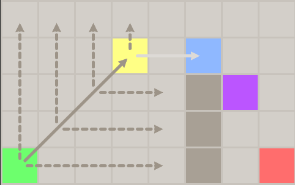

# Toteutusdokumentti

Laajoja kielimalleja ei ole käytetty projektissa.

# Rakenne

Ohjelma käyttää Avalonia UI kirjastoa käyttöliittymässä. Rakenteen voi jakaa korkealla tasolla seuraaviin:
- UI logiikka (reittien visualisointi, käyttäjän syötteet). On pääosin partial luokiksi jaetussa MainWindow luokassa.
- Reitinhakualgoritmit (Dijkstra, A*, JPS). Algoritmit on jaettu omiin luokkiinsa ```Pathfinder.Pathfinding.Algorithms``` alle.
- Apuluokat ja funktiot (karttojen lukeminen, etäisyyksien laskeminen, karttaesteiden tarkostus). Osa funktioista ```Pathfinder.Helpers``` ja osa ```Pathfinder.Pathfinding.Utils``` alla.

## Käyttöliittymä (MainWindow partial luokat)
1. MainWindow.Drawing
    - Lataa ja piirtää valitun kartan
    - Piirtää reitit kartalle
2. MainWindow.PathfindingLogic
    - Ajaa reitinhaun käyttäjän valitseman aloitus ja lopetuspisteen sekä algoritmin perusteella.
    - Mittaa ajan ja näyttää statistiikat läpi käydyistä pisteistä.

## Reitinhakualgoritmit

### Dijkstra

Käyttää PriorityQueue rakennetta johon läpi käytävien pisteiden naapurit lisätään ja josta valitaan pienimmällä etäisyydellä oleva piste seuraavaksi prosessoitavaksi.

Koodi on [täällä](/src/Pathfinder/Pathfinding/Algorithms/Dijkstra.cs)

### A*

Hyvin samanlainen toteutus kuin Dijkstra, paitsi että käytetään heurestiikkafunktiota laskemaan pisteen pienin mahdollinen etäisyys tiedettyyn maalipisteeseen.

Koodi on [täällä](/src/Pathfinder/Pathfinding/Algorithms/AStar.cs)

### Jump Point Search

Käyttää myös heurestiikkafunktiota kuten A*. Eroaa siten, että se etsii "Jump Point" pisteitä. Algoritmi valitsee kulkusuunnan ja samaan suuntaan kunnes löytää Jump Pointin. Jump Point pisteet on sellaisia pisteitä, joista reitti voi mahdollisesti kääntyä eri suuntaan. Algoritmi löytää ne etsimällä kohtia, josta kohtisuoraan liikkumalla kuljetaan seinän ohi. Alemmassa kuvassa keltaisessa pisteessä algoritmi käy läpi pisteitä oikealle ja löytää kuvassa sinisen pisteen, jonka jälkeen reitti kulkee seinän ohi.



Koodi on [täällä](/src/Pathfinder/Pathfinding/Algorithms/JumpPointSearch.cs)

## Apuluokat

## Suorituskykyvertailu

Algoritmien suorituskyky toisiinsa nähden on se mitä niiden kuuluisikin olla. Lähes kaikissa kartoissa mitä testasin on Dijkstra hitain, A* toiseksi nopein ja JPS nopein. Joissain kartoissa, kuten suurissa monimutkaisissa sokkeloissa, joissa A* heurestiikkafunktiosta ei ollut merkittävästi hyötyä ja se joutui käymään lähes yhtä monta pistettä läpi kuin Dijkstra, oli Dijkstra jopa hieman A* algoritmia nopeampi. Reittien hakuun kuluva aika myös vaihtelee aika paljon jokaisen suorituskerran välillä.

Pahimmassa tapauksessa aikavaatimus pikselikartoilla kaikilla algoritmeilla kun vinottaiset liikkeet sallitaan on O(8^d), jossa d on lyhimmän reitin pituus. Käytännössä kuitenkin A* ja JPS saavuttaa usein paremman tuloksen.

## Viitteet

- [A* search algorithm](https://en.wikipedia.org/wiki/A*_search_algorithm)
- [Online Graph Pruning for Pathfinding on Grid Maps](https://users.cecs.anu.edu.au/~dharabor/data/papers/harabor-grastien-aaai11.pdf)
- [ICAPS 2014: Daniel Harabor on "Improving Jump Point Search"](https://www.youtube.com/watch?v=NmM4pv8uQwI)
- [A Visual Explanation of Jump Point Search](https://zerowidth.com/2013/a-visual-explanation-of-jump-point-search/)
- [Jump Search Algorithm in Python – A Helpful Guide](https://www.youtube.com/watch?v=afoQvbXvaiQ)
- [Heuristics](https://theory.stanford.edu/~amitp/GameProgramming/Heuristics.html)